<h1 align="center">Hi, I'm Giggs 👋</h1>

  
  
  

---

  

---

### 📌 Pinned Projects

- **[SpectraWall](https://github.com/giggs-lynx/SpectraWall)** &middot; Audio-reactive desktop visualizer for macOS
- **[homebrew-tap](https://github.com/giggs-lynx/homebrew-tap)** &middot; Personal Homebrew formulas
- **[Noodoe](https://github.com/giggs-lynx/Noodoe)** &middot; Swift experiments
- **[exercism-solution](https://github.com/giggs-lynx/exercism-solution)** &middot; Rust exercises from Exercism
